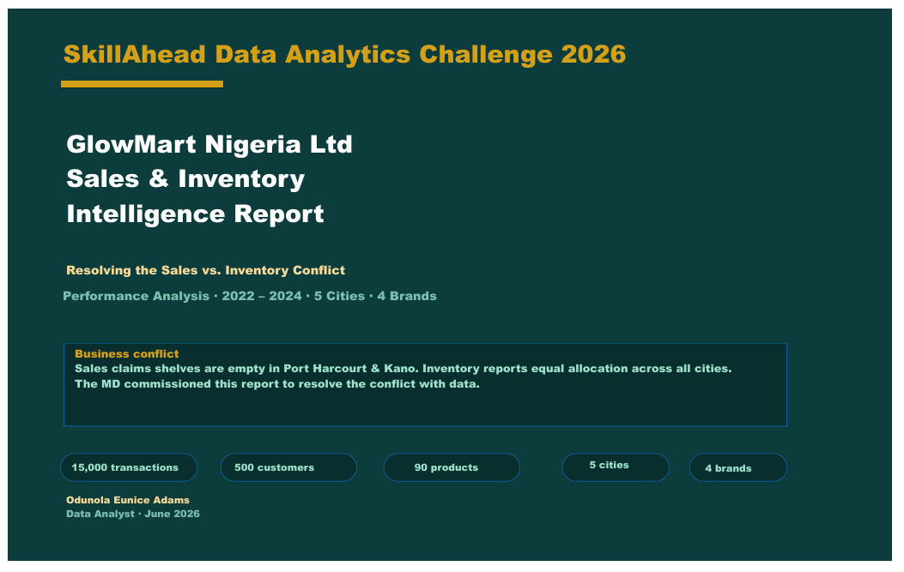
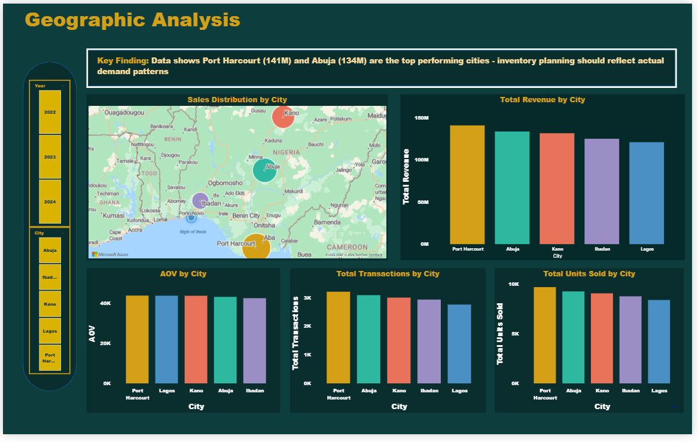
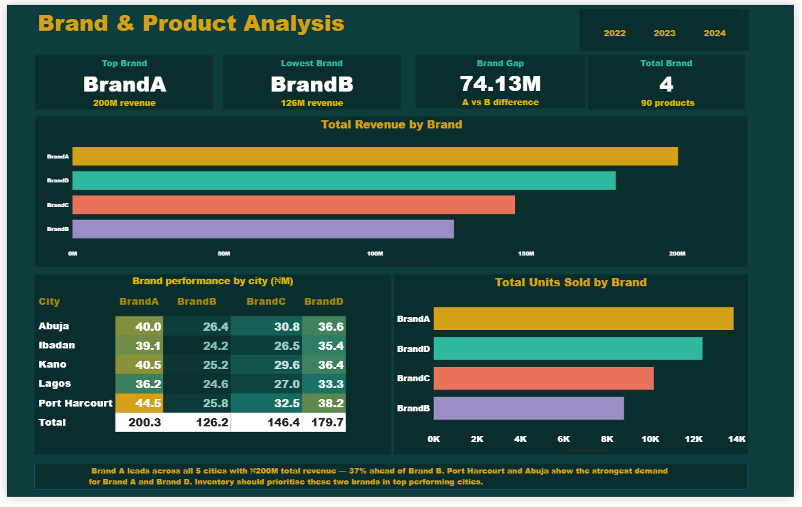
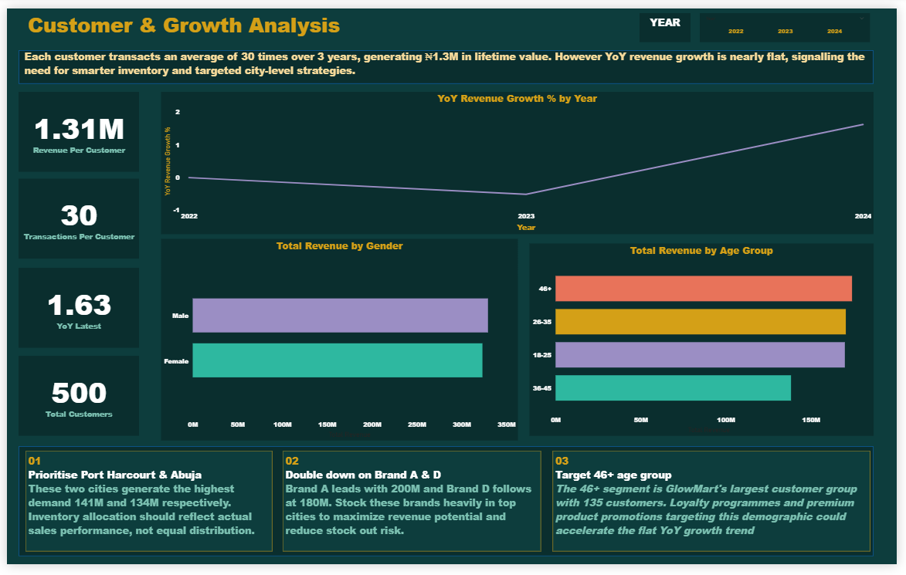

# GlowMart Nigeria Ltd — Sales & Inventory Intelligence Dashboar

 **SkillAhead Data Analytics Challenge 2026** — Resolving a corporate Sales vs. Inventory conflict using SQL and Power BI

---

## Project Overview

GlowMart Nigeria Ltd is a mid-size FMCG beauty and personal care retailer operating across 5 Nigerian cities with 500 customers, 90 products across 4 brands, and 15,000 transactions between 2022 and 2024.

### The Conflict

| Person | Claim |
|---|---|
| **Emeka Okafor** (Sales Manager) | "Shelves are empty in Port Harcourt and Kano — customers are ready to buy but there's nothing to sell." |
| **Tunde Adeyemi** (Inventory Manager) | "I stock based on what Sales tells me. My records show equal allocation across all five cities." |

The MD, Mrs. Chidinma Eze, commissioned a single dashboard to resolve the conflict with data and guide future inventory decisions.

---

## Dataset

| Table | Rows | Key Columns |
|---|---|---|
| Sales (Fact) | 15,000 | SalesID, CustomerID, ProductID, OrderDate, Quantity, TotalSales, Discount |
| Customers | 500 | CustomerID, City, Gender, AgeGroup |
| Products | 90 | ProductID, Brand, CostPrice |
| Date | 1,096 | Date, Year, Month, Quarter, DayOfWeek |

**Price range:** ₦1,000 – ₦20,000 · **Discount:** 0% – 20% · **Units per order:** 1 – 5

---

## Tools & Tech Stack

- **MySQL Workbench** — database architecture, star schema, KPI pre-validation
- **Power BI Desktop** — data modelling, DAX measures, interactive dashboard
- **SQL** — JOINs, CTEs, Window Functions (LAG), Aggregations
- **DAX** — SUMX, CALCULATE, PREVIOUSYEAR, DIVIDE, DISTINCTCOUNT, COALESCE

---

## Phase 1 — Data Engineering (MySQL)

### Database Setup

```sql
CREATE DATABASE glowmart;
USE glowmart;
```

### Star Schema Relationships

```sql
-- Primary Keys
ALTER TABLE customers ADD PRIMARY KEY (CustomerID);
ALTER TABLE products ADD PRIMARY KEY (ProductID);
ALTER TABLE date ADD PRIMARY KEY (Date);

-- Foreign Keys on Sales (Fact Table)
ALTER TABLE sales ADD CONSTRAINT fk_customer 
    FOREIGN KEY (CustomerID) REFERENCES customers(CustomerID);

ALTER TABLE sales ADD CONSTRAINT fk_product 
    FOREIGN KEY (ProductID) REFERENCES products(ProductID);

ALTER TABLE sales ADD CONSTRAINT fk_date 
    FOREIGN KEY (OrderDate) REFERENCES date(Date);
```

### KPI Pre-Validation Queries

```sql
-- KPI 01: Total Revenue
SELECT ROUND(SUM(TotalSales), 2) AS TotalRevenue
FROM sales;

-- KPI 02: Gross Profit & GP Margin %
WITH Summary AS (
    SELECT 
        SUM(s.TotalSales) AS TotalRevenue,
        SUM(s.Quantity * p.CostPrice) AS TotalCost
    FROM sales s
    JOIN product p ON s.ProductID = p.ProductID
)
SELECT 
    TotalRevenue,
    TotalCost,
    ROUND(TotalRevenue - TotalCost, 2) AS GrossProfit,
    ROUND((TotalRevenue - TotalCost) / TotalRevenue * 100, 2) AS GPMarginPercent
FROM Summary;

-- KPI 06: Revenue by City
SELECT 
    c.City,
    ROUND(SUM(s.TotalSales), 2) AS TotalRevenue
FROM customer c
JOIN sales s ON c.CustomerID = s.CustomerID
GROUP BY c.City
ORDER BY TotalRevenue DESC;

-- KPI 09: YoY Revenue Growth %
WITH YearlyRevenue AS (
    SELECT 
        d.Year,
        ROUND(SUM(s.TotalSales), 2) AS TotalRevenue
    FROM sales s
    JOIN date d ON s.OrderDate = d.Date
    GROUP BY d.Year
)
SELECT 
    Year,
    TotalRevenue,
    COALESCE(
        ROUND((TotalRevenue - LAG(TotalRevenue) OVER (ORDER BY Year)) / 
        LAG(TotalRevenue) OVER (ORDER BY Year) * 100, 2),
    0) AS YoYGrowthPercent
FROM YearlyRevenue;
```

---

## Phase 2 — Power BI Dashboard

### Data Model (Star Schema)

```
customers ──┐
products  ──┤── sales (fact table)
date      ──┘
```

### DAX Measures

```dax
-- Core Revenue
Total Revenue = ROUND(SUM(Sales[TotalSales]), 2)
Total Cost = ROUND(SUMX(Sales, Sales[Quantity] * RELATED(Product[CostPrice])), 2)
Gross Profit = [Total Revenue] - [Total Cost]
GP Margin % = ROUND(DIVIDE([Gross Profit], [Total Revenue]) * 100, 2)

-- Volume
Total Transactions = COUNTROWS(Sales)
Total Units Sold = SUM(Sales[Quantity])

-- Efficiency
AOV = ROUND(DIVIDE([Total Revenue], [Total Transactions]), 2)
Total Discount Amount = ROUND(SUMX(Sales, Sales[TotalSales] * Sales[Discount]), 2)

-- Growth
Previous Year Revenue = CALCULATE([Total Revenue], PREVIOUSYEAR('date'[Date]))
YoY Revenue Growth % = ROUND(DIVIDE([Total Revenue] - [Previous Year Revenue], [Previous Year Revenue]) * 100, 2)

-- Customer
Revenue Per Customer = ROUND(DIVIDE([Total Revenue], DISTINCTCOUNT(Sales[CustomerID])), 2)
Transactions Per Customer = ROUND(DIVIDE([Total Transactions], DISTINCTCOUNT(Sales[CustomerID])), 2)
Total Customers = DISTINCTCOUNT(Sales[CustomerID])
```

---

## Key Findings

### Revenue by City

| City | Total Revenue | Rank |
|---|---|---|
| Port Harcourt | ₦140.99M | 🥇 1st |
| Abuja | ₦133.74M | 🥈 2nd |
| Kano | ₦131.70M | 🥉 3rd |
| Ibadan | ₦125.14M | 4th |
| Lagos | ₦121.04M | 5th |

### Revenue by Brand

| Brand | Total Revenue |
|---|---|
| Brand A | ₦200.30M |
| Brand D | ₦179.73M |
| Brand C | ₦146.41M |
| Brand B | ₦126.17M |

### YoY Revenue Growth

| Year | Revenue | Growth |
|---|---|---|
| 2022 | ₦217.10M | Baseline |
| 2023 | ₦216.00M | -0.51% |
| 2024 | ₦219.51M | +1.63% |

---

## Business Recommendations

**01 — Dynamic Inventory Allocation**
End the equal distribution policy. Prioritise Port Harcourt (₦141M) and Abuja (₦134M) based on actual demand patterns — not equal city allocation.

**02 — Targeted Product Mix**
Maximise Brand A and Brand D shelf space in Port Harcourt and Abuja. A ₦74M gap between top and bottom brands proves uniform product distribution is a strategic mistake.

**03 — Demographic Retention Programme**
The 46+ age group is GlowMart's largest customer segment (135 customers). Launch targeted loyalty programmes to leverage high customer lifetime value (₦1.3M per customer) and break the flat YoY growth trend.

---

## Project Structure

```
glowmart-dashboard/
│
├── data/
│   ├── Sales.csv
│   ├── Customers.csv
│   ├── Products.csv
│   └── Date.csv
│
├── sql/
│   └── glowmart_queries.sql
│
├── dashboard/
│   └── GlowMart_Dashboard.pbix
│
└── README.md
```

---

## Dashboard Preview

### Cover Page


### Executive Summary


### Geographic Analysis


### Brand & Product Analysis


### Customer & Growth


---

## 👩‍💻 About

**Odunola Eunice Adams** — Data Analyst & Founder of Tech With Eunice

- 🌐 [LinkedIn](https://linkedin.com/in/odunolaeuniceadams)
- 📺 [YouTube — @techwitheuniceng](https://youtube.com/@techwitheuniceng)
- 📧 olatunjiodunola20@gmail.com

---

*Built as part of the SkillAhead Data Analytics Challenge 2026*
